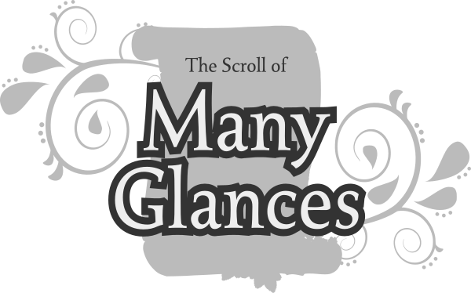
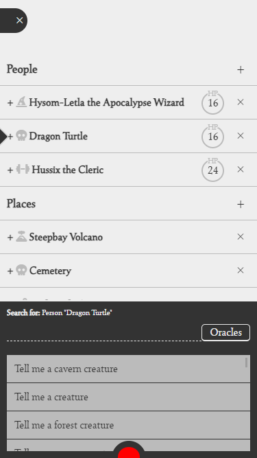
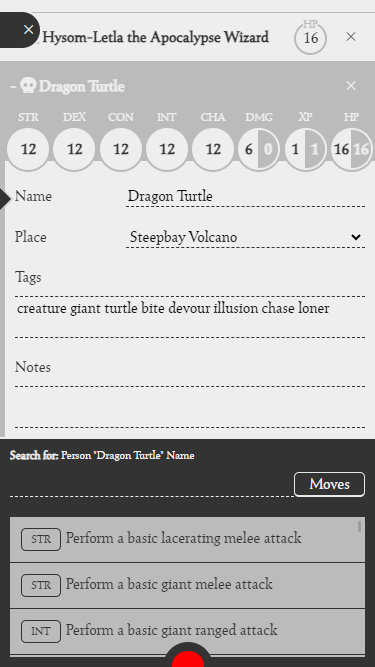
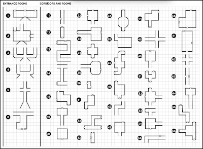
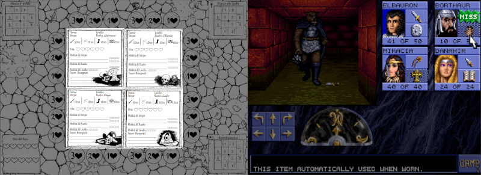
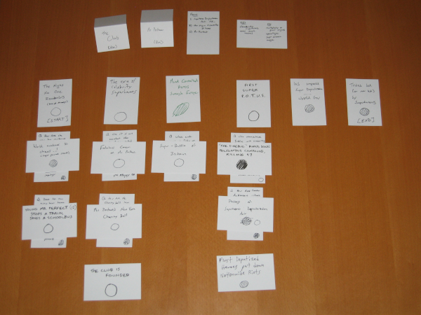
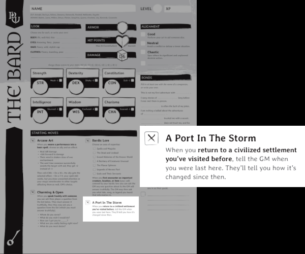
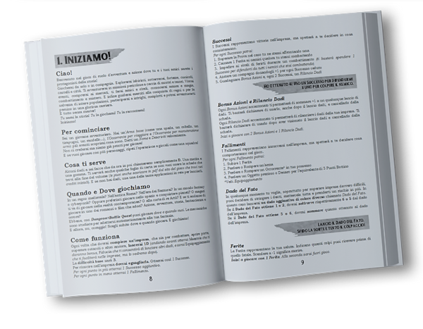

# The Scroll of Many Glances

An experimental app-supported masterless fantasy RPG thought for mobile devices and inspired by PbtA/OSR tabletop role-play games

---

<a href="https://www.kesiev.com/tsomg">Play</a> | <a href="manual/default.md">Manual</a>

---

## The story

**Well done, adventurer!** You've traversed forests and swamps, faced deep dungeons and terrible monstrosities, and now you're holding the most powerful artifact in this world: **the Scroll of Many Glances**!

Once unrolled, you can use your imagination to get a glimpse into the life of any creature of this realm. **In this story you are a god!**

    

Whenever you see an interesting person, place, or item, you can note it on the Scroll. Often a few keywords will suffice, just for you to not forget them.

I, the Black Panel, will silently read the Scroll as you move it. I know every rule of this world, so I can help you on deciding the fate of anything. **Just point it to me.**

It may all seem strange and puzzling to you. Please, take some time to just explore me and the Scroll. **I can't wait to see the stories hiding in your mind!**

## The game

**The Scroll of Many Glances** (TSoMG) is an experimental app-supported masterless fantasy RPG thought for mobile devices and inspired by [PbtA](https://en.wikipedia.org/wiki/Powered_by_the_Apocalypse) tabletop role-play games such as [Dungeon World](https://en.wikipedia.org/wiki/Dungeon_World). 

It works like a simple note-taking application with a few templates, so it won't drive the game in any way as computer RPGs usually does. Instead, the game _reads_ your notes and suggests fitting **Oracles** (randomized events and elements) and **Moves** (actions success and outcome) you may follow or not.

    

    
The Dragon Turtle character sheet

There isn't a right way to play TSoMG: you can play the role of one of the characters, follow the adventures of a group, or be just a _benevolent_, _malevolent_, or _impartial_ judging god. Just follow your creativity and let _the Black Panel_ inspire you - you'll find your way as you discover how the game works.

### Why?

After exploring some masterless dungeon crawlers and RPGs and reading some [OSR](https://en.wikipedia.org/wiki/Old_School_Renaissance) RPG manuals, I've seen that the _master streamlining or removal process_ often simplifies its decisional process using systems of **oracles** (tools and tables that procedurally generate content through a question and answer format), **triggers** (game or narration conditions that interrupt the current process and starts another one) and **modifiers** (a set of keywords or physical objects that may modify other game elements - such as triggers and oracles) with a different level of complexity, vagueness, and player involvement.

The vanilla [Four Against Darkness](https://boardgamegeek.com/boardgame/197097/four-against-darkness) _master game loop_ is made by a quite linear sequence of interconnected oracles, used to generate the current context and simulate NPC decisions, with a few triggers and modifiers (i.e. for generating larger or smaller loots).

    

    
The Four Against Darkness dungeon generator oracle

Despite its simplicity, it manages to give a convincing _dungeon-delving_ experience - but it is precisely this strength that places it into _dungeon crawler games_ instead of _masterless RPGs_. 

These games offer a linear structure, in which the player has _limited agency_ over the story and _limited choices_ to solve game events, making the experience much closer to a board game than to a tabletop RPG. In a sense, the player follows some kind of _flowchart_ that takes him from one decision to another, like a computer program.

The pen & paper dungeon crawler [Dungeon Crawlers](https://www.serpentarium.net/dungeon-crawlers) makes an interesting _reverse engineering experiment_ in this sense: starting from the famous [Eye of the Beholder](https://en.wikipedia.org/wiki/Eye_of_the_Beholder_(video_game)) first-person dungeon crawler videogame, it tries to replicate its experience on paper, codifying its key logic, interface elements, and narrative system in a compact manual.

    

    
The Dungeon Crawlers game board (left) imitating the Eye of The Beholder videogame GUI (right)

The result is interesting: although in several parts it is very similar to Four Against Darkness, it overlays a system of triggers and oracles that allows both the outline story to continue and some "setting" events to happen, giving more character to the dungeons.

To keep the computer game pace and compensate for the new narrative layer, Dungeon Crawlers simplified the character stats and the battle system - and that's a trade-off that happens very often in games.

As the designers add more player choices and more _moving parts_ to contextualize game elements and events, they make the general experience inevitably more cumbersome to manage for the player. It's a difficult compromise to resolve, so let's take a look at a game that has decided to _stake everything_ on freedom of choice and context.

In the masterless RPG [Microscope](https://boardgamegeek.com/rpg/9789/microscope) players collaborate in the non-sequential development of a timeline, imagining and acting out its key moments.

    

    
A Microscope timeline

The game describes a sequence of actions that instructs players on _how to agree_ on a net of _modifiers_, represented by a timeline made with slips of paper, which will drive their own narrative decisions and acting. The game _denies the presence of a master_ in an almost absolute way, completely delegating the players in the management of what is usually managed by _oracles_ (how to answer questions) and _triggers_ (when something happens).

The experience is very pleasant, provided you share it with someone who is not ashamed to use their creativity and acting skills, regardless of their quality.

In tabletop RPGs, the interpretation serves as a _natural user interface_ between the game and players and grants the deep agency over the story and events unique to the genre. The master represents the main user of this interface and, as such, it assumes the responsibilities of the role.

Microscope splits the master's responsibilities over all the players to get rid of it, but it forces them to have a sense of pacing, storytelling skills, and world knowledge beyond what they're used to as players - and, ever more, as novices.

However, that's the same problem a novice master or a player has: how can he develop these basic skills in a relatively short time and a coordinated manner compared to other players he will play with?

That's one of the key problems OSR role-playing games want to solve and, among the most interesting solutions I've found, there is the one implemented by the [Powered by the Apocalypse](https://en.wikipedia.org/wiki/Powered_by_the_Apocalypse) (PbtA) tabletop RPGs sub-genre, founded by the game [Apocalypse World](https://en.wikipedia.org/wiki/Apocalypse_World).

These games are very often based on the concept of **moves**: using the terms we've used so far, they are tiny self-contained _oracles_ with 3 key outcomes (success, failure, and partial success), which dice rolls are influenced by _modifiers_ based on the characters' statistics and other factors, and _triggered_ by the narrative context.

    

    
The Dungeon World bard class character sheet explaining the "A Port In The Storm" unique move

In [Dungeon World](https://en.wikipedia.org/wiki/Dungeon_World), a famous fantasy-themed RPG based on the PbtA system, there is a _Hack and Slash_ move the player may perform when attacking an enemy in melee: it rolls 2 6-sided dice, sum them with the character Strength bonus and - depending on the result - it may successfully hit the enemy and decide to expose itself for a damage bonus, miss the enemy, or _something in between_ - it may land the hit but the enemy attacks you.

Many events of the game are broken down into these _moves_, which are printed both on the game manual and on quick references or character sheets that are placed on the table for the whole game: from the ones any player can do to those that are unique for the interpreted class or the equipped items. Even the master has its moves, and so do the enemies it controls and _places_ (?) it creates. All key interactions have their own _move_ and, depending on the role, the players can put them into practice (but strictly never calling them by name) when the narrative context may need them.

Moves create a _standardized system open to everyone_, which simultaneously offers a _shared set of rules to balance the game_ and an _interpretative inspiration_ for everyone at the table: if you don't know what to do or exactly how to do it, you can scroll through your available moves to get a suggestion. The more the players will play, the less they'll need to scroll through the moves... until they'll naturally play their roles, and, as the manual explains, they'll be able to _build custom moves_ that best match the narrative!

Tabletop RPG manuals usually start by suggesting to the master to read the entire manual before starting a game. Most PbtA games are no exception and, in this case, they often consist of a relatively thin ruleset accompanied by a vast catalog of moves, and in some cases, of oracles. Reading them in advance is a key step for the master: a first overview of what may happen during the game must be clear at least to the director, to make its narration dynamic and to know how to approach the players' decisions.

But I recently got to play [Dungeon+Battle Quest](https://simonegiusti.wixsite.com/laboratoriogiochi), a masterless RPG with a universal context that invites players to play right away... and, apparently, _without a tutorial_.

    

    
The Dungeon+Battle Quest manual

The game is guided by a good number of branching oracles, which report questions and answers vague enough to fit in any context - from fantasy to cyberpunk. The game loop closely resembles that of Four Against Darkness and, if followed according to the rules, it keeps the player within the first quarter of the game manual.

The remaining three-quarters of the rulebook, which players can read by _breaking_ the branching paths, contains a large number of oracles and sub-rules that allow players to add, both within the base game and between multiple adventures, a series of actions they can perform at will: from how to manage _love affairs_ to how to _lead an army_.

In a sense, the game offers players a structured flow of play suitable for beginners and, simultaneously, offers them a system of _moves_ designed to _disrupt_ this flow at will.

It's an approach that I liked a lot, even if I found the standardized and modular structure of the moves more intriguing - albeit a little colder.

TSoMG is my attempt to create a game that offers a simple structure, mainly based on the self-definition of modifiers using keywords like Microscope, but also tries to offer the player oracles and Dungeon World-style moves with the discretion of Dungeon+Battle Quest.

For the general user experience, I based it on the mobile equivalent of slips of paper (note apps) and simulated discretion by adding a passive prompter at the bottom of the screen. When the player browses the notes, it uses [word embeddings](https://en.wikipedia.org/wiki/Word_embedding) to calculate how much the keywords written by the player and game database labels _match_, giving the prompter a sense of the _context_.

My goal is to stretch the player's creativity a bit, so I decided to add a non-binding time limit that encourages him to get better and create a new story every time - somewhat following the model of anthological TV series.

The result is quite weird but I'm satisfied with how it works. As usual, I'm sharing it with you, hoping it will entertain you a bit. Thanks for reading this far!

### Credits

#### Libraries

  - [embeddings.js](https://github.com/mb-14/embeddings.js)
  - [Font Awesome](https://fontawesome.com) free icons library

#### Data sources

  - I've adapted the [Cairn](https://cairnrpg.com/resources/more-spellbooks/)'s [CC-BY-SA 4.0](https://creativecommons.org/licenses/by-sa/4.0/) spellbook to the TSoMG mechanics and narrative system

#### Font

The game is using the excellent CC0 font [Seshat](http://dotcolon.net/font/seshat/) by Dot Colon.